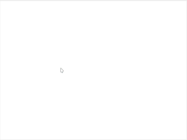

# Falling_Ball

Falling-Ball is a practice project using ggez for rust, event not a game. It may grow up as a real game with much efforts;

## falling ball color

Genarate five balls with random color and size.

